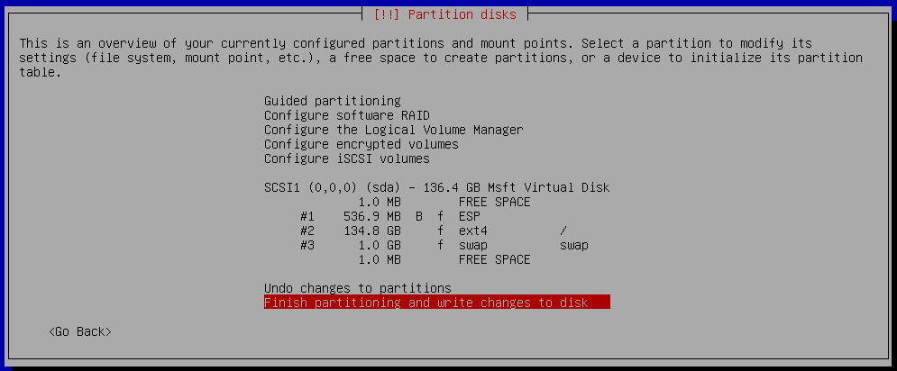

# Multifunkční VMware obraz linuxové distribuce Debian

## Zavedení virtuálního počítače

Doporučené nastavení počítače pro VMware jsou `4 jádra CPU a 6GB RAM`. Obraz byl přiložen v této práci. Počítač nemá jiné hardwarové požadavky než funčkní síťovou kartu s připojením na internet, nejlépe v nastavení bridge, a virtuální DVD mechaniku pro instalaci operačního systému.

## Instalace operačního systému na disk

Z oficálních stránek [Debian](https://www.debian.org/CD/live/) byl stažen nejnovější `live` DVD obraz této lixunové distribuce. V době instalace se jednalo o verzi 11.2.0. Následně bylo DVD zavedeno do virtuální DVD mechaniky počítače. Počítač byl nastaven na spuštění z tohoto DVD obrazu. V úvodní obrazovce GRUBu byla zvolena možnost grafického instalátoru Debianu.

### Instalační proměnné

Jako výchozí jazyk byla nastavena čeština. Umístění bylo nastaveno na Česko a klávesnice na česká.

Název hostitele (hostname) byl nastaven na `Jeff`. Název domény byl nastaven na  `sspbrno.cz`.  Dále bylo nastaveno heslo na uživatele root. Uživatel root bude později uzamčen a jeho heslo bude zneplatněno, tudíž není potřeba toto heslo uvádět. Byl vytvořen nový uživatel `administrator `s heslem `8i6vyAAB`.

### Formátování disku

Virtuální disk byl naformátován vcelku pomocí asistovaného formátování. Všechny složky byly nastaveny, aby se nacházely v jedné oblasti. Na konci řízeného formátování by měla rekapitulace vypadat takto:



Formátování disku bylo potvrzeno.

### Instalace operačního systému

Soubory operačního systému byly na disk přeneseny automaticky. Poté bylo nastaveno síťové zdrcadlo na repozitář `deb.debian.org` pro balíčkový manažer. Připojení bylo nastaveno bez využití proxy serveru.

### Instalace zavaděče

Zavadeč operačního systému byl nainstalován automaticky na `/dev/sda`.

## Nastavení prostředí

### Nastavení uživatelských účtů

Z uživatele root byla uživateli `administrator` byla přiřazena skupina `sudo` pro možnost spouštění příkazů se zvýšenými právy. Bez těchto práv by nebylo možné z tohoto účtu instalovat nové balíčky a provádět jiné potřebné příkazy.

```bash
root@Jeff:~$ sudo usermod -aG sudo administrator
```

```bash
sudo            Spustit příkaz se zvýšenými právy
usermod         Příkaz pro správu uživatelů
-a              Přidat vlastnost, nepřepisovat
-G              Změna skupiny
sudo            Název skupiny se zvýšenými právy
administrator   Jméno uživatele
```

Jestliže by chyběla možnost `-a` v příkazu, uživateli `administrator` by byli odebrány všechny ostatní skupiny.

Všechny další kroky byly prováděny z uživatelského účtu `administrator`. Nyní bylo nutné se znova na tento účet přihlásit pro zavedení přidání skupiny `sudo`

Účet `root` byl uzamčen a jeho heslo bylo zneplatněno z důvodu zabezpečení systému. Hlavně kvůli možnému zapomenutí otevřené konzole přihlášené na tomto účtě.

```bash
administrator@Jeff:~$ sudo passwd -d root
administrator@Jeff:~$ sudo passwd -l root
```

```bash
sudo        Spustit příkaz se zvýšenými právy
passwd      Příkaz pro správu hesel
-d          Smazat heslo uživatele
-l          Zamknout možnost přihlášení jako uživatel
root        Jméno uživatele
```

Příkazy je nutno napsat ve správném pořadí, jinak se nejříve zamkne možnost přihlášení jako uživatel a až poté se jeho heslo vymaže, čímž se umožní na uživatele přihlásit a dokonce i bez hesla!

Dále byl uživateli změněn výchozí shell, kde namísto výchozího prostředí `/bin/bash` byla nastavena hodnota `/usr/sbin/nologin`, což zapříčínilo, že i po přihlášení na tohoto uživatele, například pomocí příkazu `sudo su`, se místo výchozího prostředí ukáže akorát chybová hláška.

```bash
administrator@Jeff:~$ sudo usermod -s /usr/sbin/nologin root
```

```bash
sudo                Spustit příkaz se zvýšenými právy
usermod             Příkaz pro správu uživatelů
-s                  Změna shellu
/bin/sbin/nologin   Cesta k shellu
root                Jméno uživatele
```

Jestliže bychom se nyní pokusili přihlásit na uživatele root

```bash
administrator@Jeff:~$ sudo su
This account is currently not availible.
administrator@Jeff:~$
```

### Instalace balíčků

Balíčky v linuxové distribuci Debian má na stratosti balíčkový manažer `apt` , pomocí kterého budou standartně balíčky instalovány. U instalace každého balíčku bude přesto napsán příkaz, pomocí kterého byl balíček nainstalován pro případ, že by se balíček instaloval jiným způsobem.

Příklad instalace balíčku v manažeru apt

```bash
administrator@Jeff:~$ sudo apt install sl
```

```bash
sudo                Spustit příkaz se zvýšenými právy
apt                 Balíčkový manažer
install             Instalovat balíček
sl                  Název balíčku
```

Jestliže bychom chtěli balíček pouze stáhnout , ale neinstalovat, musíme přidat za tento příkaz příznak `--download-only`

Před instalací jakéhokoli balíčku je doporučeno provést aktulizaci balíčků.

### Aktulizace balíčků

Pro aktulizaci balíčků se bude používat dvojice příkazů.

#### Aktulizace databáze balíčků

První příkaz aktulizuje databázy balíčků z repozitářů specifikovaných v souboru `/etc/apt/sources.list` nebo v jakémkoli souboru končícím příponou `.list` v adresáři `/etc/apt/sources.list.d/`. Do tohoto adresáře budeme později přidávat repozitáře nové.

```bash
administrator@Jeff:~$ sudo apt update
```

```bash
sudo                Spustit příkaz se zvýšenými právy
apt                 Balíčkový manažer
update              Aktulizovat databázy balíčků
```

Jestliže by dva repozitáře obsahovali jeden stejný balíček, tak se priorizuje repozitář podle označení s vyšším číslem priority v konfiguračním souboru `/etc/apt/preferences` nebo v jakémkoli souboru v adresáři `/etc/apt/preferences.d/`. Tyto priority budeme také upravovat.

#### Stažení a instalace balíčků

Druhý příkaz stáhne a nainstaluje všechny balíčky, které mají v databázy balíčků verzi vyšší než je aktuálně nainstalovaná.

```bash
administrator@Jeff:~$ sudo apt upgrade
```

```bash
sudo                Spustit příkaz se zvýšenými právy
apt                 Balíčkový manažer
uprgade             Stáhnout a nainstalovat vyšší verzi balíčků podle databáze
```

Jestliže bychom chtěli pouze stáhnout nové verze balíčků bez jejich samotné instalace, musíme přidat za tento příkaz příznak `--download-only`

```bash
administrator@Jeff:~$ sudo apt upgrade --download-only
```

#### Odstranění balíčků

Pro odstranění balíčků bude používán tento příkaz

```bash
administrator@Jeff:~$ sudo apt remove sl
```

```bash
sudo                Spustit příkaz se zvýšenými právy
apt                 Balíčkový manažer
remove              Odstranit balíček
sl                  Název balíčku
```

Tento příkaz pouze balíček odinstaluje, ale instalační soubory a soubory aplikace nebudou odstraněny. Abychom tohoto dosáhli, musíme použít příznak `--purge`

```bash
administrator@Jeff:~$ sudo apt remove --purge sl
```

#### Automatické odstranění nepotřebných knihoven

Při instalaci programu pomocí `apt` se zároveň s ním instalují potřebné knihovny. Jestliže odstraníme program, kvůli kterému byly knihovny nainstalovány, zůstanou v počítači bez využití. Abychom nemuseli ručně mazat každou takovou knihovnu, můžeme použít následující příkaz.

```bash
administrator@Jeff:~$ sudo apt autoremove
```

```bash
sudo                Spustit příkaz se zvýšenými právy
apt                 Balíčkový manažer
autoremove          Automaticky odstranit nepotřebné knihovny
```

#### Přeinstalace balíčků

Programy je možné pomocí `apt` přeinstalovat.

```bash
administrator@Jeff:~$ sudo apt reinstall sl
```

```bash
sudo                Spustit příkaz se zvýšenými právy
apt                 Balíčkový manažer
reinstall           Přeinstalovat program
sl                  Název programu
```

### Správce procesů

Procesy aplikací, hlavně těch na pozadí, spravuje systémová služba `systemd`. Pomocí této služby je možné nastavit automatické spuštění aplikací na pozadí a sledovat zde jejich stav.

#### Nasatvení procesů

Pro spuštění procesu je nutné nastavit za jakého uživatele se má proces spustit, jakou cestu má proces hledat k spustitelnému souboru programu a příkazy k programu. Dále je zde možné nastavit podmínku spuštění např.: Pouze pokud je dostupné internetové připojení nebo spustit program každou hodinu jestliže se program sám po dokončení práce ukončí.

Veškeré mnou vytvořené procesy byly ukládany do adresáře `/etc/systemd/system/`. Procesy vytvořené instalací balíčků se ukládají do adresáře `/lib/systemd/system`.

Příklad takového nastavení

```systemd
[Unit]
Description=Příklad procesu
After=network.target
StartLimitIntervalSec=0

[Service]
Type=simple
Restart=always
RestartSec=1
User=administrator
ExecStart=/cesta/k/programu argumenty

[Install]
WantedBy=multi-user.target
```

Vysvětlení parametrů

```systemd
[Unit]            Blok s popisem procesu
Description       Popis procesu
After             Nastevení podmínky spuštění po skončení jiného procesu
network.target    Podmímka dosáhnutí aktivního připojení k síti

[Service]         Blok s informacemi o řízení procesu
Type              Typ procesu
simple            Jednoduchý proces

Restart           Nastavení znovuspuštění aplikace po vyplnutí
always            Aplikace se znovu spustí pokaždé co skončí
RestartSec        Časový interval mezi vypnutím a znovuspuštěním procesu
User              Za jaký účet se má aplikace spustit
ExecStart         Cesta k programu, který má proces zapnout + možné argumenty
(Stejnou syntaxi používají u parametrů ExecStartPre, ExecStartPost, ExecReload, ExecStop)

[Install]         Blok se speciálními informacemi
WantedBy          Specifikace vztahu tohoto procesu k procesu jinému
                  V tomto případě je tento proces žádán jiným.
multi-user.target Název procesu
```

Pro více informací o nastavení procesů viz [DigitalOcean](https://www.digitalocean.com/community/tutorials/understanding-systemd-units-and-unit-files)

Po každé modifikaci nastavení procesu je nutné zavést změny do programu `systemd`.

```bash
administrator@Jeff:~$ sudo systemctl daemon-reload
```

#### Spuštění procesu

Následující příkazy jsou čistě demonstrativní, žádný takový proces na počítači v této části dokumentace není, bude ovšem v pozdější části dokumentace přidán.

Tímto příkazem se spustí proces bez ohledu na podmínky.

```bash
administrator@Jeff:~$ sudo systemctl start mysql
```

```bash
sudo                Spustit příkaz se zvýšenými právy
systemctl           Manažer procesů na pozadí
start               Spustit proces
mysql               Název procesu
```

Jestliže bychom chtěli proces spouštět automaticky podle podmínek.

```bash
administrator@Jeff:~$ sudo systemctl enable mysql
```

#### Stav procesu

```bash
administrator@Jeff:~$ sudo systemctl status mysql
● mariadb.service - MariaDB 10.5.12 database server
     Loaded: loaded (/lib/systemd/system/mariadb.service; enabled; vendor preset: enabled)
     Active: active (running) since Tue 2021-10-19 15:26:19 CEST; 2 weeks 3 days ago
       Docs: man:mariadbd(8)
             https://mariadb.com/kb/en/library/systemd/
   Main PID: 1069 (mariadbd)
     Status: "Taking your SQL requests now..."
      Tasks: 8 (limit: 2355)
     Memory: 157.9M
        CPU: 8min 8.633s
     CGroup: /system.slice/mariadb.service
             └─1069 /usr/sbin/mariadbd
```

Příkaž vypíše detalní popis procesu a poté log výstupů procesu.

#### Vypnutí procesu

```bash
administrator@Jeff:~$ sudo systemctl stop mysql
```

Tento příkaz ukončí proces a proces zůstane vypnutý až do restartu systému. Jestliže bychom chtěli vypnout automatický start procesu.

```bash
administrator@Jeff:~$ sudo systemctl disable mysql
```

#### Restart procesu

Tento příkaz ukončí a znovu spustí proces.

```bash
administrator@Jeff:~$ sudo systemctl restart mysql
```

### Osobní nastavení

Pro jednodušší a pohodlnější práci v linuxovém prostředí byly nainstalovány následující programy.

#### Git

Škálovatelý program pro správu verzí projektu. Umožňuje klonovat projekty z internetu a za pomocí protkolu `ssh` nebo `http` zaručuje bezpečný přenos i soukromých projektů do vlastních repozitářů. Obsahuje velké množství možností, ať už podpis verzí projektů pomocí `gpg` klíče nebo řešení rozdílů mezi verzemi od více lidí. Bude použit hlavně pro klonování projektů ze serveru `github.com`

```bash
administrator@Jeff:~$ sudo apt update
...
Všechny balíky jsou aktuální.
administrator@Jeff:~$ sudo apt install git
```

#### Vim

Vysoce přizpůsobitelný textový editor pro příkazový řádek. Bude využívám k úpravám konfigurací programů.

```
administrator@Jeff:~$ sudo apt update
...
Všechny balíky jsou aktuální.
administrator@Jeff:~$ sudo apt install vim
```

#### Cerbot

Program využívaný ke generování SSL certifikátů pro komunikaci přes HTTPS protokol.

```
administrator@Jeff:~$ sudo apt update
...
Všechny balíky jsou aktuální.
administrator@Jeff:~$ sudo apt install certbot
```

## Nastavení zabezpečení pro komunikaci po síti

Pro zabezpečení komunikace po síti byly nainstalovány dva programy

### UFW - Uncomplicated FireWall

Veškerá komunikace po IP se v linuxu řeší za pomocí tabulky pravidel. UFW je program upravující tyto tabulky v mnohem jednodušším prostředí.

#### Instalace UFW

```bash
administrator@Jeff:~$ sudo apt update
...
Všechny balíky jsou aktuální.
administrator@Jeff:~$ sudo apt install ufw
```

#### Konfigurace UFW

Tabulky byly nastaveny pro odmítnutí veškeré příchozí komunikace

```bash
administrator@Jeff:~$ sudo ufw default deny incoming
```

```bash
sudo                Spustit příkaz se zvýšenými právy
ufw                 Program upravující tabulky pravidel IP
default             Nastavit výchozí hodnotu
deny                Zamezit přiopjení
incoming            Příchozí připojení
```

Dále byly nastaveny pro schávelní všech odchozích připojení

```bash
administrator@Jeff:~$ sudo ufw default allow outgoing
```

Poté jsme nastavily výjimky pro komunikaci pomocí ssh protkolu, který využijeme později.

```bash
administrator@Jeff:~$ sudo ufw allow ssh
```

Ještě byly nastaveny výjimky pro komunikaci na portech 80 a 443 využívaných HTTP a HTTPS komunikací, aby byl možný budoucí přístup na webové stránky.

HTTP - Komunikce na portu 80 pomocí protkolu TCP

```bash
administrator@Jeff:~$ sudo ufw allow 80/tcp
```

HTTPS - Komunikace na portu 443 pomocí protokolu TCP, ale i UDP

```bash
administrator@Jeff:~$ sudo ufw allow 443/tcp
administrator@Jeff:~$ sudo ufw allow 443/udp
```

Pro odstranění pravidla je možné využít následující příkaz

```bash
administrator@Jeff:~$ sudo ufw delete allow ssh
```

#### Aktivace UFW

Po nastavení pravidel musí být zapnuta samotná aplikace UFW. Zapnutím programu se veškeré komunikace budou řídit těmito pravidly, tudíž je nutné vyhodnotit jestli jsou všechna potřebná pravidla nastavena a jestli se aktivací UFW nepřeruší již některá důležitá aktivní spojení.

```bash
administrator@Jeff:~$ sudo ufw enable
```

#### Aktuální stav UFW

```bash
administrator@Jeff:~$ sudo ufw status
```

#### Deaktivace UFW

```bash
administrator@Jeff:~$ sudo ufw disable
```

### Fail2ban

Program hlídající příchozí komunikace na otevřené porty. Jestliže komunikace bude klasifikována jako útok, bude IP adresa, ze které útok přichází, dočasně zablokována. Jako útok se můžou považovat tři neúspešné pokusy o připojení na počítač pomocí ssh protokolu.

#### Instalace Fail2ban

```bash
administrator@Jeff:~$ sudo apt update
...
Všechny balíky jsou aktuální.
administrator@Jeff:~$ sudo apt install fail2ban
```

#### Konfigurace Fail2ban

Konfigurace programu nebyla změněna. Program obsahuje konfigurační soubory `/etc/fail2ban/jail.conf` a `/etc/fail2ban/jail.d/defaults-debian.conf`, které jsou ale při každé aktulizace balíčku přepisovány, proto se pro vlastní konfiguraci používají vlastní `.conf` a `.local` soubory v adresáři `/etc/fail2ban/jail.d/`. Tyto soubory mají jiné vlastnosti. Soubory `.local` přepisují hodnoty `.conf` souborů, tudíž nemusí obsahovat celou, ale pouze její změny. Pořadí čtení souborů při konfiguraci následující:

1. `/etc/fail2ban/jail.conf`
2. `/etc/fail2ban/jail.d/*.conf`
3. `/etc/fail2ban/jail.local`
4. `/etc/fail2ban/jail.d/*.local`

Pro vysvětlení konfiguračních souborů programu viz [ArchWiki](https://wiki.archlinux.org/title/Fail2ban). Po změně konfiguračních souborů je důležité program restartovat pro zavedení změn.

#### Zapnutí procesu Fail2ban

Proces programu byl automaticky spouštěn při instalaci programu, tudíž není nutné program aktivovat. Proces programu je řízen pomocí `systemd`. Název procesu je stejný jako název programu.

```bash
administrator@Jeff:~$ sudo systemctl start fail2ban
```

Pro automatický start procesu

```bash
administrator@Jeff:~$ sudo systemctl enable fail2ban
```

#### Aktuální stav procesu Fail2ban

```bash
administrator@Jeff:~$ sudo systemctl status fail2ban
```

#### Vypnutí procesu Fail2ban

```bash
administrator@Jeff:~$ sudo systemctl stop fail2ban
```

Pro vypnutí automatického startu

```bash
administrator@Jeff:~$ sudo systemctl disable fail2ban
```

## Nastavení vzdáleného přístupu

Ke vzdálenému přístupu na počítač bude využívano potokolu `ssh`.  Na počítači byl nainstalován server pro tuto komunikaci. Tato komunikace bude probíhat na výchozím portu 22. K veškeré budoucí práci na počítači byla od aktivace vzdáleného přistupu byla výhradně využívána tato služba.

```bash
administrator@Jeff:~$ sudo apt install openssh-server
```

### Konfigurace serveru vzdálelého přístupu

Před spuštěním serveru byla upravena jeho konfigurace v souboru `/etc/ssh/sshd_config`. Následující řádky byly v souboru upraveny.

```ssh
PermitEmptyPasswords no
```

Byly odmítnuty pokusy o příhlášení s prázdným heslem pro nezabezpečené účty odstraněním poznámkového znaku `#` na řádku 59.

```ssh
PermitRootLogin no
```

Byl přidán 124. řádek na konec souboru odmítající pokusy o přihlášení na uživatele `root`.

```bash
administrator@Jeff:~$ sudo vim /etc/ssh/sshd_config
"/etc/ssh/sshd_config" 125L, 3308B uložen
administrator@Jeff:~$
```

### Spuštění serveru vzdáleného přístupu

Proces programu je řízen pomocí `systemd`. Název procesu je `sshd`.

```bash
administrator@Jeff:~$ sudo systemctl start sshd
```

Byl nastaven automatický start procesu.

```bash
administrator@Jeff:~$ sudo systemctl enable sshd
```

### Aktuální stav serveru vzdáleného přístupu

```bash
administrator@Jeff:~$ sudo systemctl status sshd
```

### Deaktivace serveru vzdáleného přístupu

```bash
administrator@Jeff:~$ sudo systemctl stop sshd
```

Pro vypnutí automatického startu

```bash
administrator@Jeff:~$ sudo systemctl disable sshd
```

## Instalace NGINX webového a reverzního proxy serveru

Pro pokrytí služeb webového serveru, byl nainstalován komplexní program nginx pomocí instalčního skriptu z [mého GitHub repozitáře](https://github.com/bastakka/nginx-autoinstall), který byl stažen pomocí příkazu `wget` do domovského adrsáře `/home/administrator/`.

```bash
administrator@Jeff:~$ wget https://raw.githubusercontent.com/bastakka/nginx-autoinstall/master/nginx-autoinstall.sh
Navazuje se spojení s raw.githubusercontent.com (raw.githubusercontent.com)|185.199.110.133|:443… spojeno.
...
2022-01-29 11:44:06 (3,90 MB/s) – „nginx-autoinstall.sh“ uloženo [23305/23305]
administrator@Jeff:~$ chmod +x nginx-autoinstall.sh
administrator@Jeff:~$ sudo ./nginx-autoinstall.sh
```

Před spuštěním skriptu bylo potřeba přidat skriptu oprávnění pro spuštění pomocí příkazu `chmod +x`

Skript dal nabídku, ze které byla vybrána možnost instalace nginx.

```
[sudo] heslo pro administrator:

Welcome to the nginx-autoinstall script.

What do you want to do?
   1) Install or update Nginx
   2) Uninstall Nginx
   3) Update the script
   4) Install Bad Bot Blocker
   5) Exit

Select an option [1-5]: 1
```

Poté byl nastaven příznak pro instalaci Mainline verze Nginx, v této době se jednalo o verzi 1.21.6

```
This script will install Nginx with some optional modules.

Do you want to install Nginx stable or mainline?
   1) Stable 1.20.1
   2) Mainline 1.21.6

Select an option [1-2]: 2
```

Skript nabídl možnost instalace přídavných modulů, ze kterých byly vybrány moduly:

* Modul **HTTP/3** pro možnost komunikace pomocí h3 protokolu od společnosti [Cloudflare](https://blog.cloudflare.com/experiment-with-http-3-using-nginx-and-quiche/)
* Modul **Dynamické změny velikosti TLS záznamu** pro snížení odezvy odpovědi od společnosti [Cloudflare](https://blog.cloudflare.com/experiment-with-http-3-using-nginx-and-quiche/)
* Modul **Kódování HTTP/2 hlavičky pomocí HPACK** od společnosti [Cloudflare](https://blog.cloudflare.com/hpack-the-silent-killer-feature-of-http-2/)
* Modul **PageSpeed** pro snížení načítací doby stránek od společnosti [Apache](https://github.com/apache/incubator-pagespeed-ngx)
* Modul **Brotli** pro hustší kompresy od společnosti [Google](https://github.com/google/ngx_brotli)
* Modul **Fancyindex** pro přehlednější list souborů z Github repozitáře [ngx-fancyindex](https://github.com/aperezdc/ngx-fancyindex)
* Modul **VHS** pro monitorování provozu z Github repozitáře [nginx-module-vts](https://github.com/vozlt/nginx-module-vts)

```
Modules to install :
       HTTP/3 (⚠️ Patch by Cloudflare, will install BoringSSL, Quiche, Rust and Go) [y/n]: y
       Cloudflare's TLS Dynamic Record Resizing patch [y/n]: y
       Cloudflare's full HPACK encoding patch [y/n]: y
       PageSpeed 1.13.35.2 [y/n]: y
       Brotli [y/n]: y
       Headers More 0.33 [y/n]: n
       GeoIP (BROKEN) [y/n]: n
       Fancy index [y/n]: y
       ngx_cache_purge [y/n]: n
       nginx_substitutions_filter [y/n]: n
       ngx_http_lua_module [y/n]: n
       nginx WebDAV [y/n]: n
       nginx VTS [y/n]: y
       nginx RTMP [y/n]: n
       nginx testcookie [y/n]: n
       nginx ModSecurity [y/n]: n
       Keep sources around? [y/n]: n

Nginx is ready to be installed, press any key to continue...
```

Po skončení práce skriptu byl úspěšně nainstalován nginx, což mohlo být vyzkoušeno pomocí příkazu `sudo nginx -V`, ve kterém můžeme vidět všechny nainstalované moduly a verze použitých prostředků.

```
administrator@Jeff:~$ sudo nginx -V
nginx version: nginx/1.21.6
built by gcc 10.2.1 20210110 (Debian 10.2.1-6)
built with OpenSSL 1.1.1 (compatible; BoringSSL) (running with BoringSSL)
TLS SNI support enabled
configure arguments: --prefix=/etc/nginx --sbin-path=/usr/sbin/nginx --conf-path=/etc/nginx/nginx.conf --error-log-path=/var/log/nginx/error.log --http-log-path=/var/log/nginx/access.log --pid-path=/var/run/nginx.pid --lock-path=/var/run/nginx.lock --http-client-body-temp-path=/var/cache/nginx/client_temp --http-proxy-temp-path=/var/cache/nginx/proxy_temp --http-fastcgi-temp-path=/var/cache/nginx/fastcgi_temp --user=nginx --group=nginx --with-cc-opt=-Wno-deprecated-declarations --with-cc-opt=-Wno-ignored-qualifiers --with-openssl=/usr/local/src/nginx/modules/quiche/quiche/deps/boringssl --with-quiche=/usr/local/src/nginx/modules/quiche --with-http_v2_hpack_enc --with-threads --with-file-aio --with-http_ssl_module --with-http_v2_module --with-http_mp4_module --with-http_auth_request_module --with-http_slice_module --with-http_stub_status_module --with-http_realip_module --with-http_sub_module --add-module=/usr/local/src/nginx/modules/incubator-pagespeed-ngx-1.13.35.2-stable --add-module=/usr/local/src/nginx/modules/ngx_brotli --add-module=/usr/local/src/nginx/modules/fancyindex --add-module=/usr/local/src/nginx/modules/nginx-module-vts --with-http_v3_module
administrator@Jeff:~$
```

Skript zároveň při instalaci samotného programu již zavedl automatické spuštění jeho procesu do systémové služby `systemd` pod cestou `/lib/systemd/system/nginx.service`.

```
administrator@Jeff:~$ cat /lib/systemd/system/nginx.service
# Stop dance for nginx
# =======================
#
# ExecStop sends SIGSTOP (graceful stop) to the nginx process.
# If, after 5s (--retry QUIT/5) nginx is still running, systemd takes control
# and sends SIGTERM (fast shutdown) to the main process.
# After another 5s (TimeoutStopSec=5), and if nginx is alive, systemd sends
# SIGKILL to all the remaining processes in the process group (KillMode=mixed).
#
# nginx signals reference doc:
# http://nginx.org/en/docs/control.html
#
[Unit]
Description=A high performance web server and a reverse proxy server
After=network.target nss-lookup.target

[Service]
Type=forking
PIDFile=/run/nginx.pid
ExecStartPre=/usr/sbin/nginx -t -q -g 'daemon on; master_process on;'
ExecStart=/usr/sbin/nginx -g 'daemon on; master_process on;'
# See https://github.com/angristan/nginx-autoinstall/issues/67
ExecStartPost=/bin/sleep 0.1
ExecReload=/usr/sbin/nginx -g 'daemon on; master_process on;' -s reload
ExecStop=-/sbin/start-stop-daemon --quiet --stop --retry QUIT/5 --pidfile /run/nginx.pid
TimeoutStopSec=5
KillMode=mixed

[Install]
WantedBy=multi-user.target
administrator@Jeff:~$
```

Skript také nastavil konfigurační soubor pro balíčkového manažera. Tento konfigurační soubor říká, že se mají veškeré balíčky začínající slovem `nginx` ignorovat. Toto bylo nastaveno aby balíčkový manažer nenarušoval instalaci provedenou tímto skriptem. Konfigurační soubor pro balíčkového manažera najdeme pod cestou `/etc/apt/preferences.d/nginx-block`.

```
administrator@Jeff:~$ cat /etc/apt/preferences.d/nginx-block
Package: nginx*
Pin: release *
Pin-Priority: -1
```

### Nastavení NGINX

Po instalaci byly upraveny konfigurační soubory NGINX pro větší bezpečnost při komunikaci pomocí SSL a pro ulehčení zátěžě v případě možných zátěžových útoků či při komunikaci s již neaktivními zařízeními. Dále byla nastavena komprese pomocí modulu brotli a byl aktivován modul pagespeed s cestama pro jeho správu. Jednalo se o soubor `/etc/nginx/nginx.conf.`

```
administrator@Jeff:~$ cat /etc/nginx/nginx.conf
user www-data;
worker_processes auto;
worker_rlimit_nofile 10960;
pid /run/nginx.pid;

events {
    worker_connections 4096;
    use epoll;
    multi_accept on;
    epoll_events 512;
}

http {
    include /etc/nginx/mime.types;
    default_type application/octet-stream;

    access_log /var/log/nginx/access.log main;
    error_log /var/log/nginx/error.log main;

    aio threads;
    sendfile on;
    tcp_nopush on;
    tcp_nodelay on;
    server_tokens off;

    client_header_buffer_size 3m;
    large_client_header_buffers 4 2m;
    client_header_timeout 1m;
    client_max_body_size 8m;
    client_body_buffer_size 256k;
    client_body_timeout 3m;

    reset_timedout_connection on;
    keepalive_timeout 30;
    keepalive_requests 10000;
    send_timeout 10;

    brotli on;
    brotli_static on;
    brotli_buffers 16 8k;
    brotli_comp_level 6;
    brotli_types *;

    pagespeed on;
    pagespeed StatisticsPath /ngx_pagespeed_statistics;
    pagespeed GlobalStatisticsPath /ngx_pagespeed_global_statistics;
    pagespeed MessagesPath /ngx_pagespeed_message;
    pagespeed ConsolePath /pagespeed_console;
    pagespeed AdminPath /pagespeed_admin;
    pagespeed GlobalAdminPath /pagespeed_global_admin;
    pagespeed FileCachePath /var/ngx_pagespeed_cache;

    include /etc/nginx/snippets/ssl-params.conf;
    include /etc/nginx/conf.d/*.conf;
    include /etc/nginx/sites-enabled/*.conf;
}
administrator@Jeff:~$
```

Tato konfigurace odkazuje na soubor `/etc/nginx/mime.types`, který byl vytvořen při instalaci NGINX. Dále odkazuje na soubor `/etc/nginx/snippets/ssl-params.conf`, který vypadá následovně.

```
administrator@Jeff:~$ sudo cat /etc/nginx/snippets/ssl-params.conf
ssl_protocols TLSv1.2 TLSv1.3;
ssl_prefer_server_ciphers off;
ssl_ciphers ECDHE-ECDSA-AES128-GCM-SHA256:ECDHE-RSA-AES128-GCM-SHA256:ECDHE-ECDSA-AES256-GCM-SHA384:ECDHE-RSA-AES256-GCM-SHA384:ECDHE-ECDSA-CHACHA20-POLY1305:ECDHE-RSA-CHACHA20-POLY1305:DHE-RSA-AES128-GCM-SHA256:DHE-RSA-AES256-GCM-SHA384;
ssl_session_cache shared:SSL:10m;
ssl_session_tickets off;
ssl_session_timeout 1d;
ssl_dhparam /etc/nginx/snippets/dhparam.pem;
```

V tomto souboru je nastavena komunikace pomocí SSL pro bezpečnou, ale zároveň spolehlivou komunikaci. Tento soubor nebyl vytvořen při instalaci a musel být vytvořen ručně zároveň se souborem `/etc/nginx/snippets/dhparam.pem`, který byl vytvořen pomocí následujícího příkazu.

```
administrator@Jeff:~$ curl https://ssl-config.mozilla.org/ffdhe2048.txt > /etc/nginx/snippets/dhparam.pem
```

Jedná se o klíč, pomocí kterého jsou generované jiné klíče pro komunikaci pomocí Diffieho–Hellmanovi výměny klíčů.

Dále tato konfigurace načítá veškeré soubory končící `.conf` v adresáři `/etc/nginx/sites-enabled/` do kterého budeme vkládat symbolické odkazy na soubory v adresáři `/etc/nginx/sites-availible/`, ve kterém budou veškeré konfigurace ke každému hostovi poskytovanému pomocí NGINX.

### Příkladný host pro NGINX

//TODO SSL cerfikát na škole

Pro kontrolu funkčnosti nginx v komunikaci s internetových prohlížečem byla vytvořen následující host poskytující na portu 80 testovací stránku nginx zkopírovanou z adresáře `/etc/nginx/html/index.html` do nově vytvořeného adresáře `/var/www/default`. Práva adresáře byla předána uživately `www-data`, za kterého nginx operuje.

```
administrator@Jeff:~$ sudo mkdir /var/www/default
administrator@Jeff:~$ sudo cp /etc/nginx/html/index.html /var/www/default/
administrator@Jeff:~$ sudo chown -R www-data /var/www/
```

Konfigurace hosta vypadala následovně

```
server {
    listen 80 default_server;
    listen [::]:80 default_server;
    server_name _;

    access_log /var/log/nginx/default-access.log;
    error_log /var/log/nginx/default-error.log;

    root /var/www/default;
    index index.html;
}
```

Host byl vytvořen v adresáři `/etc/nginx/sites-available/` a následně byl vytvořen jeho symbolický odkaz v adresáři `/etc/nginx/sites-enabled/`. Poté byl nginx restartován pro zavedení hosta.

```
administrator@Jeff:~$ sudo ln -s /etc/nginx/sites-available/default.conf /etc/nginx/sites-enabled/
administrator@Jeff:~$ ls -la /etc/nginx/sites-enabled/
celkem 8
drwxr-xr-x 2 root root 4096 29. led 18.33 .
drwxr-xr-x 7 root root 4096 29. led 17.44 ..
lrwxrwxrwx 1 root root   39 29. led 18.33 default.conf -> /etc/nginx/sites-available/default.conf
administrator@Jeff:~$ sudo nginx -s reload
```

Nyní bylo dostupné se za pomocí IP adresy stroje dostat pomocí internetového prohlížeče k testovací stránce.

### Instalace cloudového serveru

### Instalace PCMS
